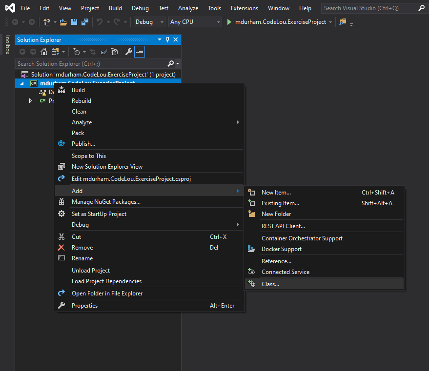
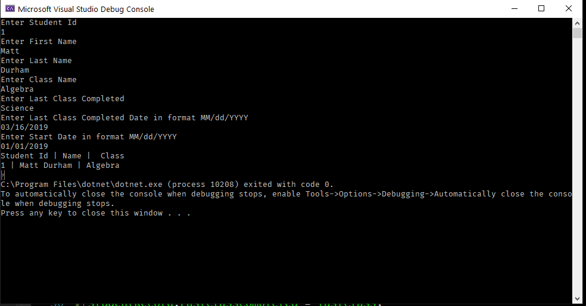
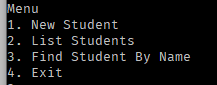
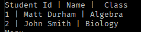
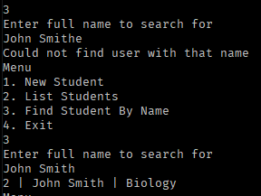

# Overview

Each project builds on the previous, so it's essential that each one is completed successfully.

### Prerequisites

- `Fork this project` - [Download](https://github.com/SamirBanjanovic/SamirBanjanovic.CodeLouisville.CSharp.Projects.Docs.git)
- `.net core sdk` - [Download](https://dotnet.microsoft.com/download/dotnet-core/2.1)
- `Git` - [Download](https://git-scm.com/downloads)
- `Visual Studio` - [Download](https://visualstudio.microsoft.com/vs/community/)
- __Optional__ - A Git UI 
    - GitKraken  - [Download](https://www.gitkraken.com/git-client)
    - GitHub Desktop (macOS, Windows) - [Download](https://desktop.github.com/)

# Project summaries

### Project 1:
- Creating a new `Console` application
- Introduction to `classes`
- Introduction to handling `user input`
- Introduction to `nuget packages`
  - Wonder if need to cover this now?

### Project 2:
- Git branching 
- User input validation - `?`
- Introduction to `loops`
- Introduction to `Collections`

### Project 3:
- Saving input to a file (json)
- Loading objects from a file (json)
- Updating objects from a file (json)


# Project 1

## Goals and Needs

In this project we will create a simple application that prompts the user for input fields to populate a student object.  When the input is complete we will display the information back to the user. This will teach basic input and output along with creating objects.

- Create a new `Console` application and name it `[YourName].CodeLou.ExerciseProject`

`dotnet new console -n [YourName].CodeLou.ExcerciseProject`

- Create a new `class` and name it `Student` - make sure it's in the `Student.cs` file
- Add the following `properties` to your `Student` class
    - `StudentId` as `int`
    - `FirstName` as `string`
    - `LastName` as `string`
    - `ClassName` as `string`
    - `StartDate` as `DateTimeOffset`
    - `LastClassCompleted` as `string`
    - `LastClassCompletedOn` as `DateTimeOffset`
    - Note for `int` you will need to convert the `Console.ReadLine` input to an `int` using `Convert.ToInt32(Console.ReadLine)`
    - Note for `DateTimeOffset` you will need to conver the `Console.ReadLine` input to a `DateTimeOffset` via `DateTimeOffset.Parse(Console.ReadLine())`

## Creating New Class



## Example Output



## Example Code

```
static void Main(string[] args)
{
    Console.WriteLine("Enter Student Id");
    var studentId = Convert.ToInt32(Console.ReadLine());
    Console.WriteLine("Enter First Name");
    var studentFirstName = Console.ReadLine();
    Console.WriteLine("Enter Last Name");
    var studentLastName = Console.ReadLine();
    Console.WriteLine("Enter Class Name");
    var className = Console.ReadLine();
    Console.WriteLine("Enter Last Class Completed");
    var lastClass = Console.ReadLine();
    Console.WriteLine("Enter Last Class Completed Date in format MM/dd/YYYY");
    var lastCompletedOn = DateTimeOffset.Parse(Console.ReadLine());
    Console.WriteLine("Enter Start Date in format MM/dd/YYYY");
    var startDate = DateTimeOffset.Parse(Console.ReadLine());

    var studentRecord = new Student();
    studentRecord.StudentId = studentId;
    studentRecord.FirstName = studentFirstName;
    studentRecord.LastName = studentLastName;
    studentRecord.ClassName = className;
    studentRecord.StartDate = startDate;
    studentRecord.LastClassCompleted = lastClass;
    studentRecord.LastClassCompletedOn = lastCompletedOn;
    Console.WriteLine($"Student Id | Name |  Class "); ;
    Console.WriteLine($"{studentRecord.StudentId} | {studentRecord.FirstName} {studentRecord.LastName} | {studentRecord.ClassName} "); ;
    Console.ReadKey();

}
```

## Challenge

Add a loop to allow the user to enter new student and display the output. Ask the user if they want to continue at the end of every loop. 


# Project 2

## Goal

Store the list of students and allow them to be accessed. Along with validating the input and reprompting for invalid input. The search should tell the user if the name could not be found. Input validation should use `DateTimeOffset.TryParse` and `Int32.TryParse` commands. Prompt them to re-enter the value if it does not validate.

## Work

### Step 1

Take the conditional loop that you created in the challenge in the previous project. After the object is created add the project to a `List<StudentRecord>` and a `Dictionary<string,StudentRecord>`, then build a menu to allow users to.

1. Enter new student
2. List all students
3. Search for student by name
4. Exit

## Example








# Challenge

Allow the user to search by users for class and make the search case insenstive. So for instance the studennt could have class `History` and `historY` or `HISTORY` should return the same results, then print out those results.

# Project 3

## Goal 

Building on top of Project 2 allow the users to save the students to a file named `students.json`. You will

1. Load students from this file
2. Update records in a collection
3. Save the file to disk

For this you will need to install `Newtonsoft` which handles reading and writing to json files. This can be accomplished via Visual Studio manage nuget packages OR `dotnet add package Newtonsoft.Json --version 12.0.2` running this commandline will install the needed package. You will need some basic checks to check if the file exists or not.

The code should look similiar to

```
_recordList = JsonConvert.DeserializeObject<List<Student>>(json);
```

```
var json = JsonConvert.SerializeObject(_recordList);
```
And use the `File.IO` functions to read and write the `List<Student>` object/json to and from file. 

The json should look something similiar to 

```
[
    {
        "StudentId": 1,
        "FirstName": "Matt",
        "LastName": "Durham",
        "ClassName": "History",
        "StartDate": "2018-03-12T00:00:00-04:00",
        "LastClassCompleted": "Science",
        "LastClassCompletedOn": "1991-03-16T00:00:00-05:00"
    },
    {
        "StudentId": 2,
        "FirstName": "Johhny",
        "LastName": "Smith",
        "ClassName": "History",
        "StartDate": "1976-04-12T00:00:00-04:00",
        "LastClassCompleted": "Biology",
        "LastClassCompletedOn": "1998-03-16T00:00:00-05:00"
    }
]
```

## Challenge

Validate that the `LastClassCompletedOn` comes after the `StartDate` and that the `StudentId` is unique. In the sense that in the above JSON Johnny Smith could NOT have a `StudentId` of 1.